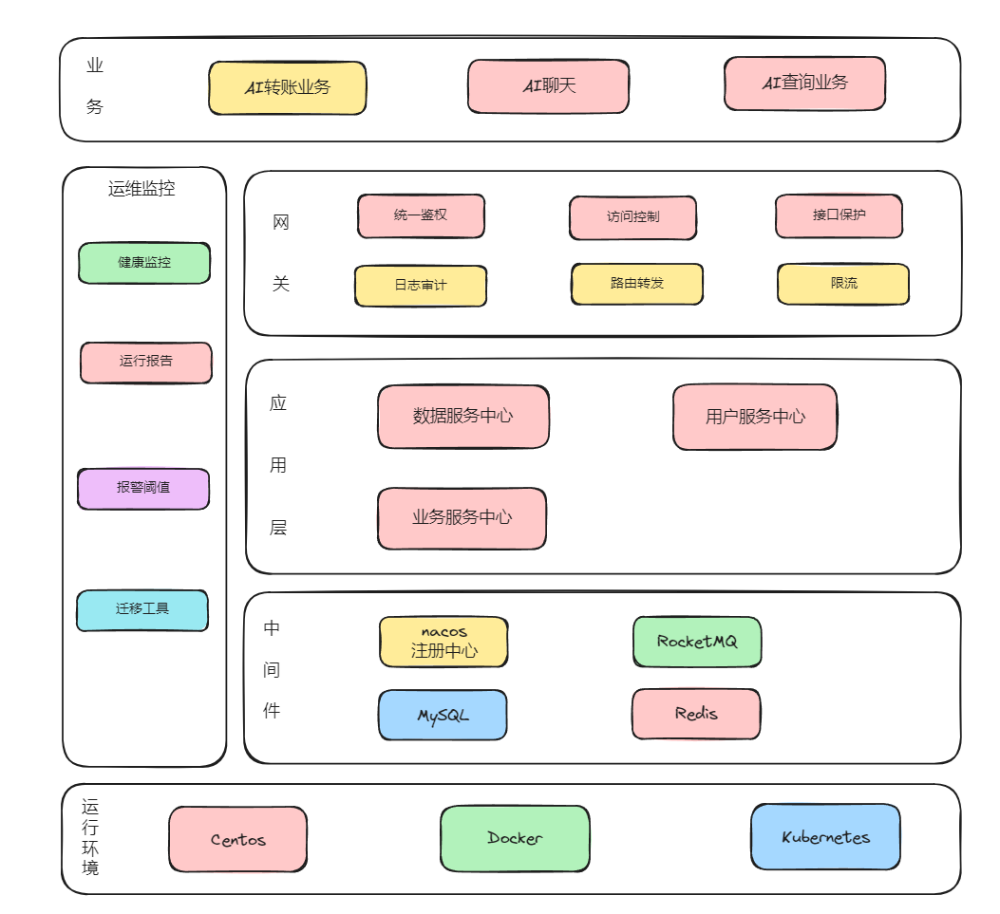

# Viro

## 项目介绍
在AI大时代的发展下，许多银行也将业务逐渐融合AI的优势，提高业务的审核效率，优化审核和查询的流程，提高客户线上办理业务的体验感。 该项目是
用户与虚拟数字人互动，AI协助用户办理业务，比如转账，查账，可贷款金额，银行卡管理等。

## 项目架构图

暂定



## 项目结构

```text
├─viro-master---------------------------------父项目，公共依赖
│
├─viro-common---------------------------------通用包
│  │
│  ├─viro-common-ai---------------------------有关ai的通用包，比如：调用deepseek ai模型
│  │
│  ├─viro-common-api--------------------------整合不同云的api，比如：腾讯云的TTS
│  │
│  ├─viro-common-base-------------------------公共基础包
│  │
│  └─viro-common-config-----------------------公共配置包
│
│
├─viro-gateway--------------------------------网关
│
└─viro-provider-------------------------------后端API的父项目
    │
    ├─viro-provider-ai------------------------ai服务中心
    │
    ├─viro-provider-dsc-----------------------数据服务中心
    │
    └─viro-provider-fsc-----------------------文件服务中心
       

```

## 项目运行 

1. 建表：复制`config/init-mysql-db.sql`的sql语句进行建库建表
2. 创造数据：使用脚本生成假数据 `config/faker_data.py`

## 项目计划

设计数据库表

造数据（使用python的faker包造50w数据）

## 技术栈

前端： React | uniapp

后端： java17 + spring boot3 + nacos(配置中心) + Dubbo(RPC框架) + kafka | RocketMQ(消息中间件) + MySQL(关系型数据库) + Redis(缓存)


## 业务流程

AI助手可办理以下业务：

1. 手机转账
2. 查询交易明细
3. 理财产品
4. 银行卡管理
5. 我的资产
6. 查询可贷款的金额


### 业务1： 手机办理转账

1. 用户与AI助手聊天，让AI助手查询余额， AI助手返回银行卡余额
2. 用户想要转账，AI助手返回银行卡管理的数据，供用户选择
3. 用户选择后，AI助手提问转多少钱
4. 用户回答后，跳转转账链接，并自动填写刚刚用户提问过的信息